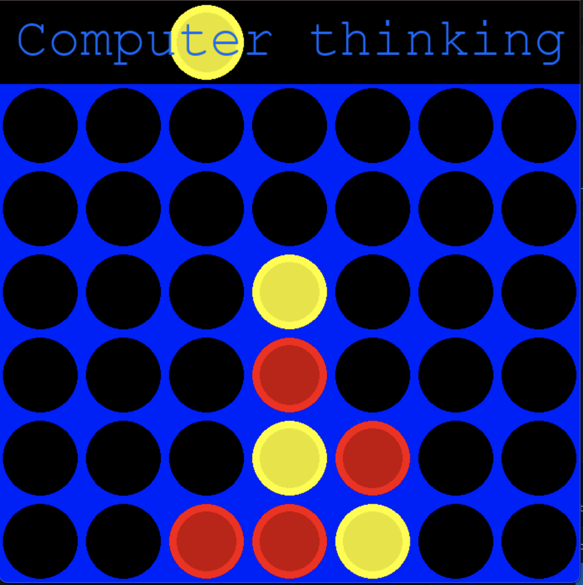
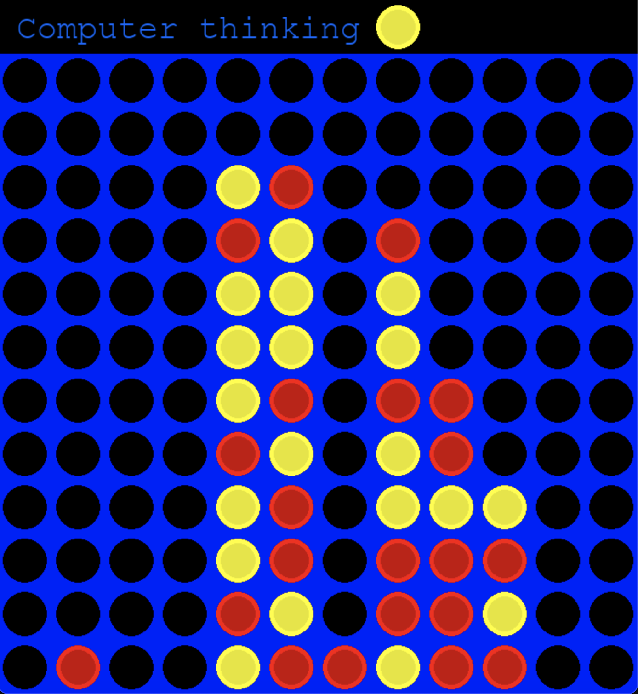

# Connect Four

Gameplay image on standard board

This is a connect four game that you can play against an AI opponent. I wrote this game from scratch in a way that allows you to choose the size of the n x m board. The AI opponent plays with a minimax algorithm and uses alpha-beta pruning for efficiency. The depth can be changed easily--at higher depths, the program takes longer to run on each turn, but the computer will play more optimally. Find the code for this project [here](https://github.com/ghartmann4/connectfourgame).

Here's an example of what the game looks like on a larger board:

Gameplay image on large board

## Minimax Algorithm
A minimax algorithm works recursively by assuming that each player will try to maximize their own score and minimize their opponent's score. The algorithm works to a certain depth, and calls itself at each new level to pick find the best move. When the limit of the depth is reached, if the position reached is not terminal, an evaulation function is used to estimate the evaluation the position (that is, it assigns a numerical value that esimates if the position is better for Player 1, better for Player 2, or equal).

This score is passed back to the previous level in the recursion. It's typical to use a positive score to indicate an evaluation that is better for Player 1 and a negative score to indicate an evaluation that is better for Player 2, as I have done here. At this earlier level, all of the positions that can be reached are compared, and the move that leads to the best result is chosen. (If it is Player 1 to play in that position, the move that leads to the highest evaluation will be returned, while if it is Player 2 to play, the move that leads to the lowest evaluation will be returned.) This move and corresponding evaluation are then passed back to the prior level in the recursion again. The process continues in this way until the initial level of recursion is reached, which returns a move to play in the position that was originally passed to the function.

While the code can be a bit complicated, the idea of minimax is simple: imagine playing a game and thinking a few moves ahead. You would think to yourself, "if I go here, then they will go here, then I will go here..." and so on, always trying to keep in mind that your opponent will employ the same logic to make their moves.

In practice, a depth of even just 4-5 seems to provide an even match for most human players (at least for my family and friends), and at depth of 7 it plays nearly perfectly. 

## Alpha-beta Pruning

Minimax algorithms can be costly because they branch out quickly--given n columns, then at each level there might be n moves to consider, and then each of the n positions reached from those moves has another n positions that can be reached, and so on. (At depth d, there could be n^d calls to the function.)

Alpha-beta pruning is one method to optimize the algorithm. The idea behind Alpha-beta pruning is simple. As you build a tree of possible positions, you don't even need to construct branches that you know you will never go down if somewhere earlier in the tree either player would have had a better option. 

For instance, imagine I am thinking two moves ahead, and I have two possible options at each move. If I play move "A", my opponent can play move "A1" or "A2", which lead to evaluations of +2 and +4. My opponent tries to minimize my score, so I know they would play move "A2". I could also play move "B", and my opponent could play move "B1" or "B2". I think about move "B1" and realize that my opponent's move "B1" would lead to an evaluation of -1. Since I know that -1 is lower than the worst I could do on the "A" branch (+2), I don't even need to calculate what the position would be if my opponent played "B2"--no matter what number that evaluation would be, I'll definitely end up playing move "A" from the starting position. For one move, this might not seem to make a big difference, but as the tree gets larger, it's possible you could shear prune large swaths of the tree without calculating them!

## Position Evaluation
Unless run without a depth limit--which can be computationally impossible-- a minimax algorithm is only as good as its evaluation function. It might seem a little strange--if we can evaluate a position, why not call such a function on the initial position, and ignore the minimax logic altogether? Of course, the evaluation function merely #estimates# the postition evaluation. The minimax function is still crucially important for performance, becuase its important to realize how your opponent's next move will influence the game.

Designing a useful evaluation functions can be an art. For instance, a simple evaluation function in a game of chess might work by counting the amount of material on the board and comparing it, while a more complicated one might take into account the location of the pieces, and assign a better score for pieces that control more squares.

For connect four, one could also choose different ways to evaluate a position. I've gone for a relatively simple approach that is nonetheless elegant and effective. When the game starts, it creates an "evaluation table" that simply iterates over every position in the board and assigns it a value based on the number of possible Connect-4 combinations that position can be a part of. For instance, corner cells will always have a score of 3 in the evaluation table, since they can be a part of 3 different Connect-4 combinations (one horizontal, one vertical, and one diagonal). A position is evaluated simply by summing the scores corresponding to each players pieces and returning the difference.
