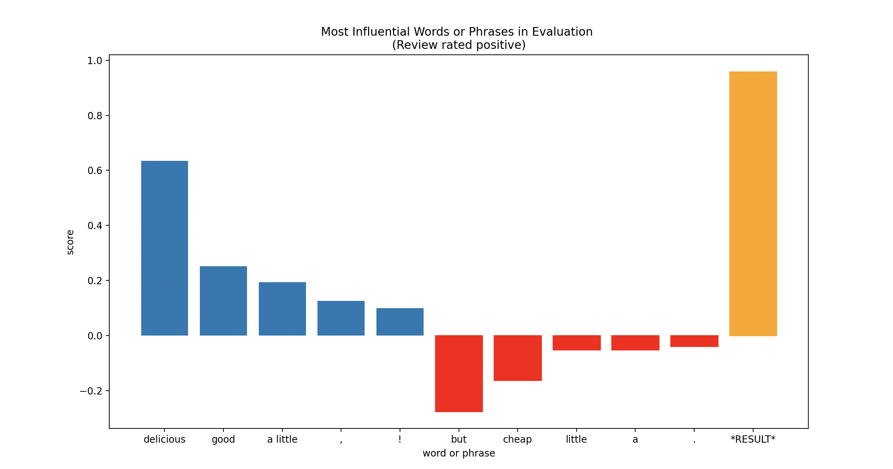

# About

I am a pianist and programmer. I recently completed my doctorate in music; my dissertation is ["The Reciprocal Interaction of Musical Performance and Analysis"](https://academicworks.cuny.edu/gc_etds/5754/).

During my doctorate, I held a Digital Fellowship through the Graduate Center's Digital Initiatives (GCDI). In this capacity, I led workshops on digital skills, held consultations, ran the Python User Group, and helped develop various other projects and initiatives. In the summer of 2024, I taught the GC Summer Python Intensive.

In my free time, I like to build things. Some of my coding projects can be found below! Here you can find [more about me.](./about-me)

# Connect Four AI

This is a connect four game that you can play against an AI opponent. The AI utilizes a minimax algorithm that implements alpha-beta pruning to select its moves. [Here](./connect-four.html) you can find a more in-depth description of this project.

# Machine Learning Classification

This program trains an ML model on a database of positive and negative Amazon product reviews. One can apply the trained model to new, unlabeled reviews to predict whether they are positive or negative. Because the model is relatively simple, focusing only on individual words, bigrams, and punctuation, I added an explanation feature that displays a bar graph that helps to show how the label was computed. [Learn more](./ML-reviews.html) about this project.

# Parsimonious Voice Leading in Different Spaces

I presented a paper called "Expanding Parsimony: Exploring an Extended Definition of Parsimony in Pitch-Class Spaces of Higher Cardinalities" at the 2020 meeting of the Society for Music Theory. I wrote a program that calculated different trichords that are parsimoniously related in different cardinalities (that is, in musical systems in which the octave is divided into different numbers of pitch classes). Based on an extended definition of parsimony, I demonstrated the existence of more parsimoniously-related trichords than previously acknowledged. Find more about this project [here](./parsimony.html).

