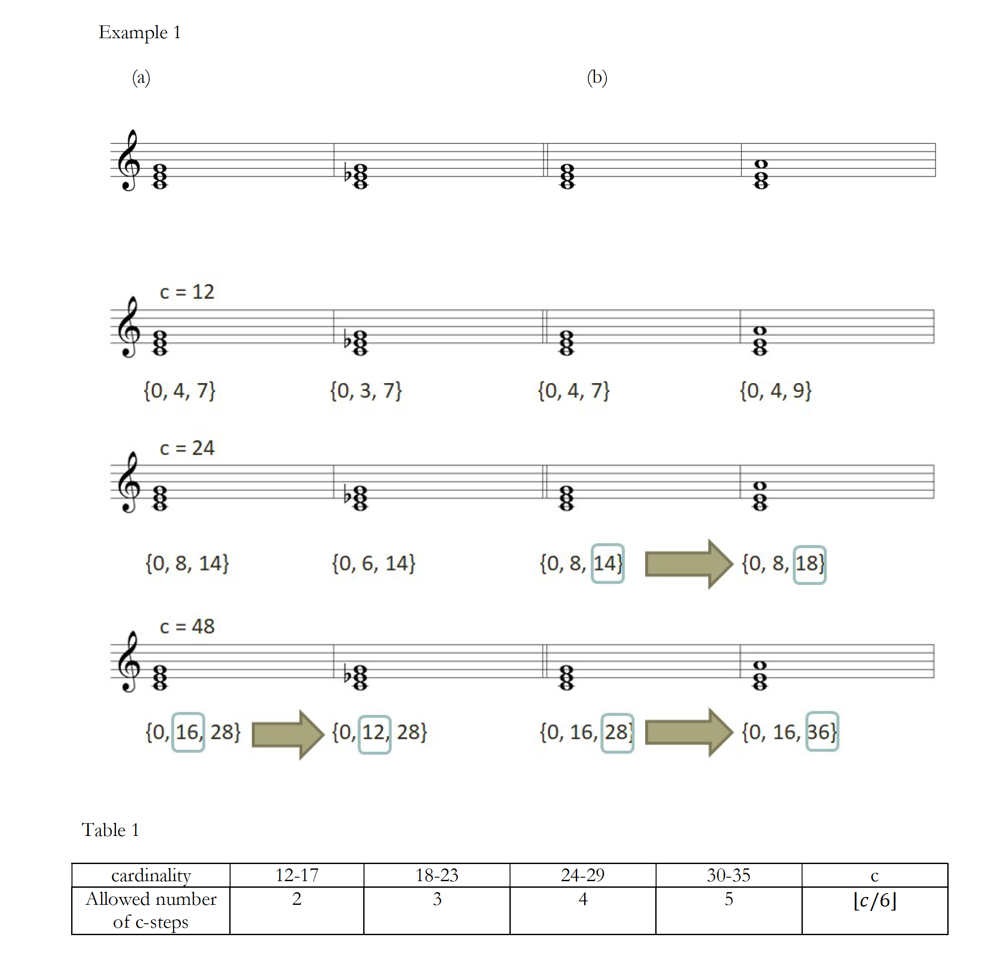

# Parsimony in Microtonal Music

Using a script that I wrote, I demonstrated the existence of parsimonious trichords in music in cardinalities other than 12. [Watch the presentation.](https://youtu.be/nT_NuaeOyCs) Find the code for this project here.

Here is Example 1 with the pitch-class integers labelled beneath the score. (*) And here is the same voice-leading diagram as before, except with pitch-class integers instead of note names. We now see that this motion actually contains three c-steps from G to A. Under the stricter requirement, this would not be considered parsimonious voice-leading, and would not be considered an R-relationship. However, since in a 19-tone division of the octave, this motion of 3 steps is less than a standard whole-tone, under our expanded definition,  it is an R-relationship.

It turns out that under the more restrictive definition of parsimony, trichords that exhibit the parsimonious relationships P, L, and R are only found in cardinalities that are integer multiples of three, while under the expanded version this is not the case.

Why do we typically draw the line between a “step” and a “leap” between a major second and a minor third? David Huron explains this question in his article, “Tone and Voice: A Derivation of the Rules of Voice-Leading from Perceptual Principles”. He suggests that the “fission boundary in effect identifies a psychoacoustic basis for the distinction between conjunct and disjunct melodic motions. What theorists call conjunct intervals are virtually guaranteed to evoke the perception of stream continuation.” “Stream continuation” here refers to perceiving of adjacent notes as a single musical line. This suggests that there is a psychoacoustic basis for treating intervals below a certain size as steps­­ and larger intervals as leaps.

(*) Given a cardinality of c, the expanded option allows motion of up to c/6 steps. Table 1, above, summarizes the allowed voice leading motion under this expanded definition. A key benefit of this expanded definition is that it prevents the motion from becoming imperceptibly small at higher cardinalities. Of course, as c increases, the distance between consecutive pitch-classes becomes smaller. Because of this, it may become more difficult to hear the difference between pitch-classes separated by a single c-step, especially when other notes are interposed between them. 

